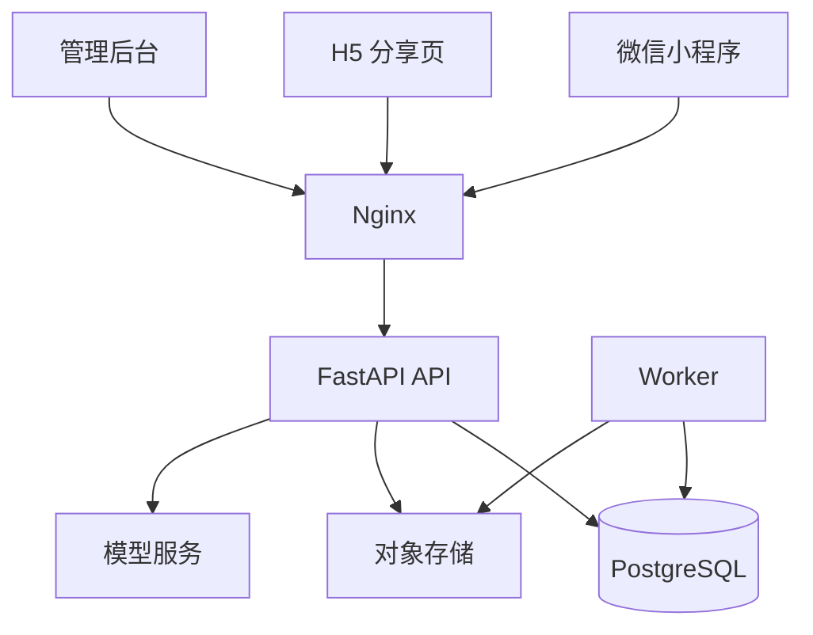

# 系统架构

> 文档编号：A01
> 状态：草案
> 版本号：v0.4.0
> 最后更新时间：2026-04-12
> 审核人：待定
> 生效日期：2026-04-12
> 负责人：待定

## 变更记录

| 版本号 | 日期 | 变更人 | 变更说明 |
| --- | --- | --- | --- |
| v0.1.0 | 2026-04-12 | Codex | 创建系统架构文档首版。 |
| v0.2.0 | 2026-04-12 | Codex | 增加前端 `pnpm` 与 Python `uv` 依赖管理约束。 |
| v0.3.0 | 2026-04-12 | Codex | 增加数据契约基线：数据库 ID 使用 `bigint`、API 层返回字符串 ID，时间字段使用毫秒时间戳。 |
| v0.4.0 | 2026-04-12 | Codex | 明确前端实现收敛：H5 与微信小程序统一由 `frontend/miniapp`（Taro）产出，不再维护独立 H5 工程。 |

## 文档目的
- 说明系统技术选型、模块划分、职责边界、数据流和扩展路径。

## 目标读者
- 技术负责人
- 前后端工程师
- 运维工程师

## 关联文档
- [业务流程](../design/D02-business-flows.md)
- [接口设计](../design/D03-api-design.md)
- [部署与运维](./A02-deployment-and-ops.md)

## 技术选型
- 用户端（微信小程序 + H5）：`Taro + React + TypeScript`
- 管理端：`React + Vite + Ant Design`
- 图表：`ECharts`
- API 服务：`FastAPI + Pydantic + SQLAlchemy`
- 前端依赖管理：`pnpm`
- Python 依赖管理：`uv`
- 数据库：`PostgreSQL 16`
- 异步任务：数据库任务表 + Python Worker
- 容器：`Docker` + `Docker Compose`
- 网关：`Nginx`
- 数据契约：数据库 ID 使用 `bigint`，API 层返回字符串 ID；时间字段使用 UTC 毫秒时间戳

## 选型理由
- `Taro` 适合一套 React 代码复用到微信小程序和 H5。
- 前端收敛到单一用户端工程，可减少双端重复开发与发布链路分叉。
- `FastAPI` 具备较高开发效率、天然 OpenAPI 支持、AI 集成成本低。
- `pnpm` 便于前端多工程场景的依赖去重与一致性管理。
- `uv` 在 Python 依赖解析和环境同步上更快，适合 API 与 Worker 并行开发。
- `PostgreSQL` 适合事务型业务、聚合查询、JSONB 扩展与后续数据分析。
- 模块化单体比微服务更适合首版低成本交付与快速迭代。

## 总体架构图

## 模块划分

### auth
- 微信登录
- JWT 签发与刷新
- 用户身份绑定

### family
- 家庭创建
- 成员邀请与角色管理
- 家庭时区和配置管理

### baby
- 宝宝档案
- 基础生长信息
- 参考区间配置

### event
- 统一事件写入
- 事件详情查询
- 编辑删除与审计

### summary
- 日报、周报、月报生成
- 数据校验与补算

### analytics
- 趋势图查询
- 统计口径封装
- 多指标统一输出

### notify
- 规则扫描
- 提醒事件生成
- 消息中心

### report
- 报告导出
- 分享页令牌管理

### ai
- 数据上下文拼装
- 问答接口
- 日报周报 AI 总结

### admin
- 运营后台接口
- 规则模板与字典配置
- AI 和导出日志查看

## 模块间原则
- 所有查询都必须显式带上家庭和宝宝上下文。
- 聚合逻辑只允许放在 `summary` 和 `analytics` 模块，不在控制器层散落统计。
- AI 模块不直接绕过业务模块查原始数据，应复用聚合结果和领域服务。
- 导出与提醒必须走异步任务，不阻塞写入接口。

## 扩展路径
- 当前：单体 API + 单 worker + 单库。
- 下一步：数据库迁移到托管版、worker 独立扩容。
- 再下一步：按模块拆为独立部署单元，但保持 API 口径不变。
