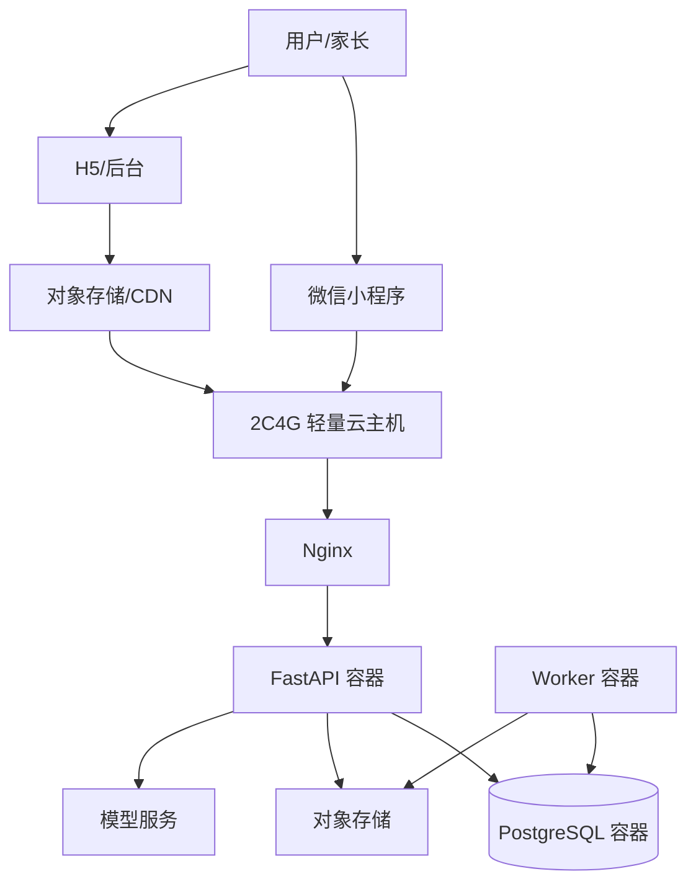

# 部署与运维

> 文档编号：A02
> 状态：草案
> 版本号：v0.3.0
> 最后更新时间：2026-04-12
> 审核人：待定
> 生效日期：2026-04-12
> 负责人：待定

## 变更记录

| 版本号 | 日期 | 变更人 | 变更说明 |
| --- | --- | --- | --- |
| v0.1.0 | 2026-04-12 | Codex | 创建部署与运维文档首版。 |
| v0.2.0 | 2026-04-12 | Codex | 明确前端 `pnpm` 与 Python `uv` 的构建依赖管理约束。 |
| v0.3.0 | 2026-04-12 | Codex | 明确前端收敛策略：H5 由 `frontend/miniapp` 统一构建；本地 Compose 增加 `h5` 容器挂载 `miniapp/dist` 用于联调测试。 |

## 文档目的
- 给出首版容器化部署方案、环境变量、监控、备份和低成本运维路径。

## 目标读者
- 运维工程师
- 后端工程师
- 技术负责人

## 关联文档
- [系统架构](./A01-system-architecture.md)
- [安全与合规](./A03-security-and-compliance.md)

## 首版部署策略
- 单云单地域单实例。
- 使用 `Docker Compose` 部署 `nginx + h5 + api + worker + postgres`（本地联调）。
- 本地联调前需先在宿主机执行 `pnpm --filter @baby-growth/miniapp build:h5`，`h5` 容器直接挂载并托管 `frontend/miniapp/dist`。
- H5 和管理后台静态资源建议部署到对象存储 + CDN。
- 微信小程序通过微信开放平台独立发布。

## 构建与依赖管理约束
- 前端工程统一使用 `pnpm` 安装和管理依赖，不混用 `npm` 或 `yarn`。
- Python 工程统一使用 `uv` 管理环境和依赖，不混用 `pip`、`poetry` 或 `pipenv`。
- CI 和镜像构建阶段应保持与本地一致的依赖管理工具，避免锁文件和环境差异。

## 部署拓扑图

## 容器职责
- `nginx`：HTTPS 终止、静态代理、反向代理、限流。
- `h5`：用户端 H5 静态资源托管（由 `frontend/miniapp` 构建产物提供）。
- `api`：REST API、鉴权、业务逻辑。
- `worker`：汇总任务、导出任务、提醒扫描、AI 摘要。
- `postgres`：主数据库。

## 环境变量建议
- `APP_ENV`
- `APP_SECRET`
- `JWT_SECRET`
- `DB_HOST`
- `DB_PORT`
- `DB_NAME`
- `DB_USER`
- `DB_PASSWORD`
- `WECHAT_APP_ID`
- `WECHAT_APP_SECRET`
- `OBJECT_STORAGE_ENDPOINT`
- `OBJECT_STORAGE_BUCKET`
- `OBJECT_STORAGE_ACCESS_KEY`
- `OBJECT_STORAGE_SECRET_KEY`
- `LLM_BASE_URL`
- `LLM_API_KEY`

## 健康检查
- `GET /api/v1/health/live`
- `GET /api/v1/health/ready`
- `ready` 需检查数据库连接和对象存储配置状态。

## 日志与监控
- API 输出结构化 JSON 日志。
- Worker 记录任务开始、结束、失败原因和重试次数。
- Nginx 记录访问日志和错误日志。
- 首版可先用主机级监控 + 日志落盘，不强依赖 Prometheus。

## 备份方案
- 数据库每日定时备份到对象存储。
- 导出报告存对象存储，设置生命周期和过期策略。
- 关键配置保留 `.env.example`，生产环境配置独立管理。

## 恢复方案
- 使用最近备份恢复 PostgreSQL。
- 使用镜像和 Compose 配置恢复应用容器。
- 恢复后执行只读巡检：登录、事件查询、日报、趋势、导出。

## 成本控制建议
- 计算：`2C4G` 轻量云足以承载首版验证。
- 存储：将静态资源和导出文件下沉到对象存储，避免主机磁盘增长过快。
- 中间件：首版不引入 Redis、MQ、ES。
- 扩容优先级：先升数据库，再拆 Worker，再上多实例 API。
