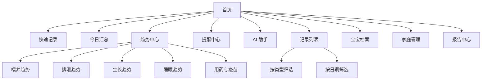

# 信息架构

> 文档编号：D01
> 状态：草案
> 版本号：v0.2.0
> 最后更新时间：2026-04-12
> 审核人：待定
> 生效日期：2026-04-12
> 负责人：待定

## 变更记录

| 版本号 | 日期 | 变更人 | 变更说明 |
| --- | --- | --- | --- |
| v0.1.0 | 2026-04-12 | Codex | 创建信息架构文档首版。 |
| v0.2.0 | 2026-04-12 | Codex | 增加前端实现约束：H5 与微信小程序页面由 `frontend/miniapp`（Taro）统一产出。 |

## 文档目的
- 定义小程序、H5 和管理后台的信息结构、页面树、导航关系和关键页面组成。

## 目标读者
- 产品经理
- 交互设计师
- 前端工程师

## 关联文档
- [需求与范围](../product/P02-requirements-and-scope.md)
- [业务流程](./D02-business-flows.md)

## 端能力划分
- 微信小程序：核心记录、查询、趋势、提醒、AI 问答、家庭协作。
- H5：分享页、报告页、部分趋势页复用（由小程序同一代码工程编译产出）。
- 管理后台：运营配置、数据审计、导出任务和 AI 日志管理。

## 用户端页面树

## 小程序导航结构
- 底部主导航：
  - 首页
  - 记录
  - 趋势
  - AI
  - 我的
- 首页快捷入口：
  - 快速喂养
  - 快速排泄
  - 快速测量
  - 快速睡眠
  - 报告
  - 提醒

## 核心页面说明

### 首页
- 顶部：当前家庭、当前宝宝切换器。
- 今日卡片：今日喂养总量、排泄次数、睡眠总时长、最近一次测量。
- 快速记录入口：常用 4 类高频记录。
- 异常与提醒卡片：疫苗到期、用药待执行、异常体温、长时间未喂养。

### 快速记录页
- 按记录类型切换表单。
- 默认带最近一次输入习惯，如最近常用喂养方式、默认单位。
- 支持即时提交与“继续新增”。

### 记录列表页
- 支持按日期范围、宝宝、类型、成员筛选。
- 卡片展示：时间、类型、摘要值、创建人、备注。
- 可进入编辑、删除、查看详情。

### 趋势中心
- 顶部选择时间范围：7 天、30 天、90 天、自定义。
- 子图表：
  - 喂养总量趋势、喂养方式占比
  - 排泄次数趋势、性状分布
  - 体重/身高/头围增长曲线
  - 睡眠总时长与夜醒次数趋势
  - 用药执行率和疫苗时间线

### AI 助手
- 输入自然语言问题。
- 展示最近推荐问题。
- 回答卡片包含结论、引用统计区间、免责声明。

### 报告中心
- 日报、周报、月报切换。
- 可选择时间范围并发起导出。
- 查看导出历史与分享页。

### 家庭管理
- 家庭资料、宝宝列表、成员列表、邀请入口。
- 角色变更、移除成员、时区设置。

## 管理后台信息架构
- 工作台
- 家庭管理
- 宝宝管理
- 事件审计
- 提醒规则模板
- AI 会话日志
- 导出任务
- 字典配置
- 系统设置

## H5 页面范围
- 报告分享页
- 趋势分享页
- 通用隐私政策和协议页

## 前端实现约束
- 用户端前端统一在 `frontend/miniapp` 维护，通过 `Taro` 分别构建微信小程序与 H5 目标。
- 不再维护独立 `frontend/web` 工程，避免页面与接口契约出现双份实现偏差。
