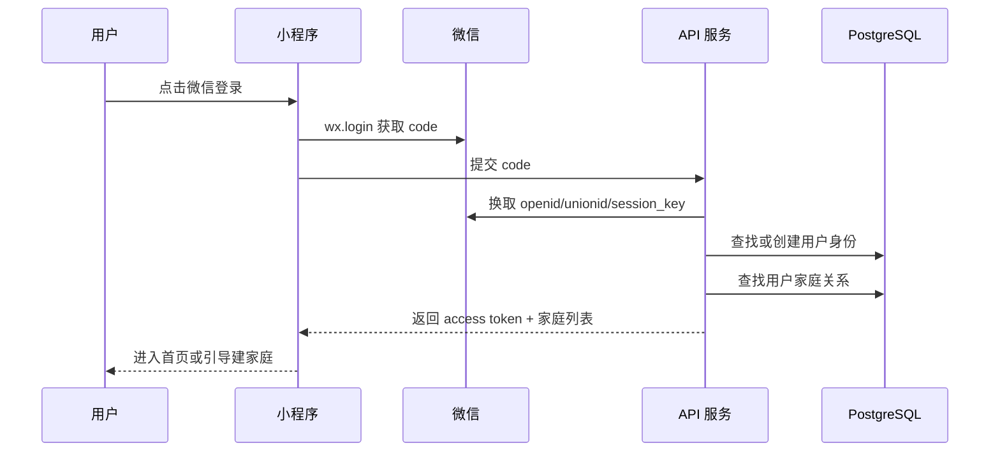
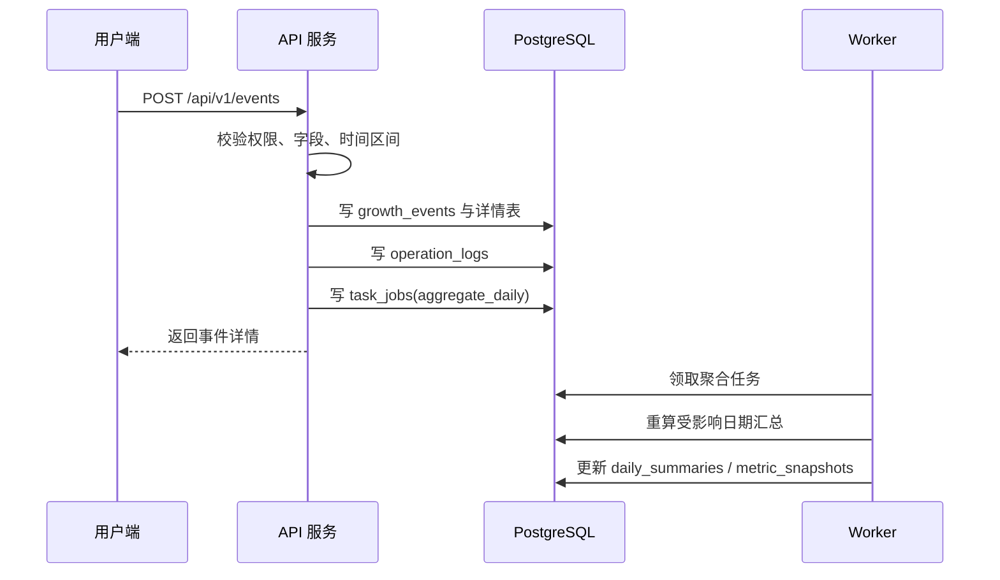
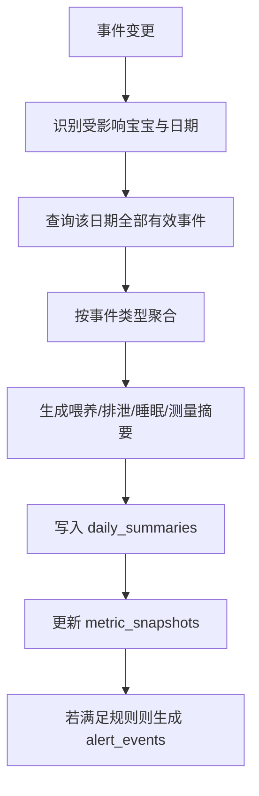
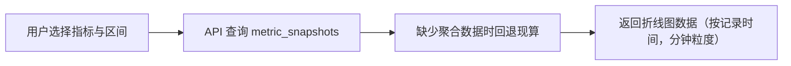
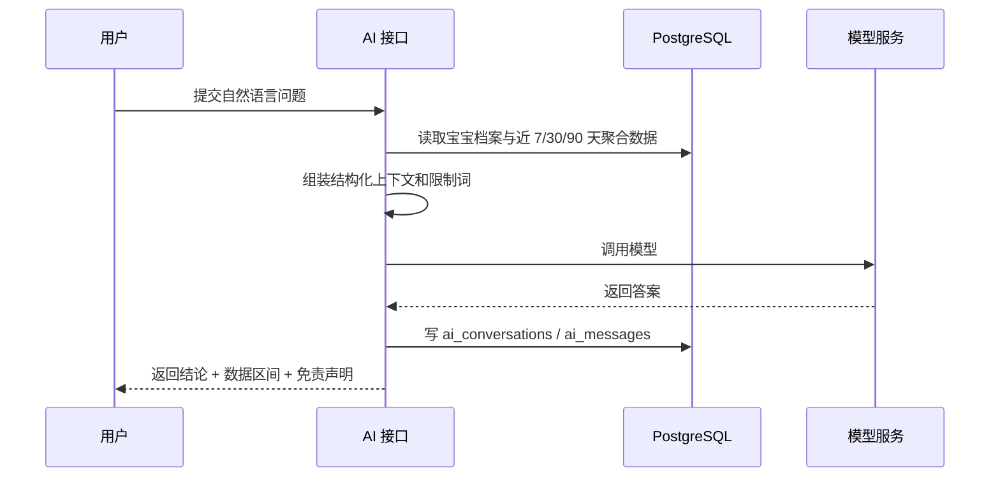

# 业务流程

> 文档编号：D02
> 状态：草案
> 版本号：v0.2.0
> 最后更新时间：2026-04-13
> 审核人：待定
> 生效日期：2026-04-12
> 负责人：待定

## 变更记录

| 版本号 | 日期 | 变更人 | 变更说明 |
| --- | --- | --- | --- |
| v0.1.0 | 2026-04-12 | Codex | 创建业务流程文档首版。 |
| v0.2.0 | 2026-04-13 | Codex | 趋势查询流程明确为按记录时间轴（分钟级）返回折线图数据。 |

## 文档目的
- 统一关键业务流程、上下游职责和异常分支，避免产品和研发对口径理解不一致。

## 目标读者
- 产品经理
- 前后端工程师
- 测试工程师

## 关联文档
- [信息架构](./D01-information-architecture.md)
- [系统架构](../architecture/A01-system-architecture.md)
- [接口设计](./D03-api-design.md)

## 1. 注册登录与进入家庭

## 2. 家庭与宝宝初始化流程
- 家庭管理员首次登录后创建家庭。
- 创建家庭时默认建立一个家庭管理员成员关系。
- 添加宝宝时录入姓名、昵称、性别、出生日期、出生体重、出生身高、出生头围、预产期、时区。
- 可邀请其他家庭成员加入家庭。

## 3. 统一事件写入流程

## 4. 历史补录与编辑流程
- 用户可编辑过去日期的事件。
- 系统记录 `old_value` 与 `new_value` 到操作日志。
- 若编辑涉及时间变更，则旧日期和新日期都要进入重算队列。
- 删除采用软删除，汇总和趋势同时重算。

## 5. 日报生成流程

## 6. 趋势查询流程

## 7. 提醒触发流程
- 定时任务按规则扫描：
  - 喂养间隔规则
  - 用药待执行规则
  - 疫苗到期规则
  - 定期测量规则
- 命中规则后生成 `alert_events`。
- 首页和提醒中心读取未处理提醒。

## 8. AI 问答流程

## 9. 报告导出流程
- 用户发起日报/周报/月报导出。
- API 创建 `export_tasks` 并写任务队列。
- Worker 聚合内容、渲染 HTML/PDF、上传对象存储。
- 导出成功后回写下载地址和过期时间。
- H5 分享页按权限令牌展示脱敏内容。

## 异常与失败分支
- 登录失败：返回可重试错误码和微信侧提示。
- 无家庭权限：接口直接返回 `403`。
- 事件重复提交：可通过前端幂等键或后端防重策略处理。
- 导出失败：允许重试并记录失败原因。
- AI 服务不可用：返回结构化兜底提示，不影响主流程。
