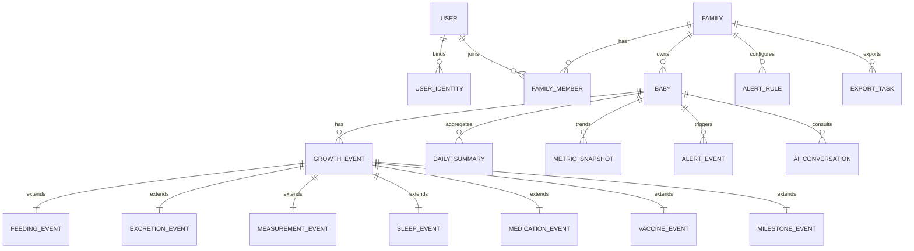

# 领域数据模型

> 文档编号：D04
> 状态：草案
> 版本号：v0.2.0
> 最后更新时间：2026-04-12
> 审核人：待定
> 生效日期：2026-04-12
> 负责人：待定

## 变更记录

| 版本号 | 日期 | 变更人 | 变更说明 |
| --- | --- | --- | --- |
| v0.1.0 | 2026-04-12 | Codex | 创建领域数据模型文档首版。 |
| v0.2.0 | 2026-04-12 | Codex | 增加 ID 与时间字段类型基线（`bigint` + 毫秒时间戳）。 |

## 文档目的
- 用领域语言定义核心实体、关系、状态和约束，作为接口和数据库设计的中间层。

## 目标读者
- 后端工程师
- 架构师
- 产品经理

## 关联文档
- [接口设计](./D03-api-design.md)
- [数据库设计](./D05-database-design.md)

## 类型约定
- 所有主键和外键 ID 使用 `bigint`。
- 所有时间相关字段（如 `*_at`、`*_date`、`*_start`、`*_end`）使用 UTC 毫秒时间戳。

## 核心实体

### User
- 平台用户。
- 关键属性：展示名、手机号密文、状态、最近登录时间。

### UserIdentity
- 外部身份绑定。
- 关键属性：`provider`、`openid`、`unionid`、凭证元数据。

### Family
- 数据隔离和协作边界。
- 关键属性：名称、时区、状态。

### FamilyMember
- 用户与家庭的关系实体。
- 关键属性：角色、加入时间、邀请状态。

### Baby
- 业务统计主体。
- 关键属性：姓名、昵称、性别、出生日期、出生体征、状态。

### GrowthEvent
- 统一事件主实体。
- 关键属性：
  - `event_type`
  - `occurred_at`
  - `start_at`
  - `end_at`
  - `timezone`
  - `notes`
  - `status`
  - `payload_snapshot`
- 作用：承载共性字段，统一列表、筛选、审计和异步重算入口。

### FeedingEvent
- 喂养详情。
- 关键属性：喂养方式、容量、单位、是否夜间、是否双侧。

### ExcretionEvent
- 排泄详情。
- 关键属性：排泄类型、性状、颜色、是否异常。

### MeasurementEvent
- 测量详情。
- 关键属性：体重、身高、头围、手长、腿长、体温。

### SleepEvent
- 睡眠详情。
- 关键属性：开始时间、结束时间、时长、夜醒次数、质量标签。

### MedicationEvent
- 用药详情。
- 关键属性：药品、剂量、单位、计划时间、实际执行时间、执行状态。

### VaccineEvent
- 疫苗详情。
- 关键属性：疫苗名称、计划时间、接种时间、机构、批次、状态。

### MilestoneEvent
- 里程碑详情。
- 关键属性：里程碑类型、发生时间、描述。

### DailySummary
- 每日汇总实体。
- 关键属性：喂养总量与拆分、排泄次数与拆分、睡眠时长、最近测量快照、异常清单。

### MetricSnapshot
- 趋势图查询专用指标点。
- 关键属性：指标编码、日期粒度、数值、单位、标签。

### AlertRule
- 提醒规则配置。
- 关键属性：规则类型、阈值、时间窗口、是否启用、作用范围。

### AlertEvent
- 规则命中产生的提醒事件。
- 关键属性：级别、内容、命中时间、状态、处理人。

### AiConversation / AiMessage
- AI 问答会话与消息。
- 关键属性：问题、答案、模型、上下文区间、状态、失败原因。

### ExportTask
- 报告导出任务。
- 关键属性：报告类型、时间范围、状态、文件地址、过期时间。

### OperationLog
- 审计日志。
- 关键属性：操作人、资源类型、资源 ID、变更前后值、来源端。

## 实体关系图

## 生命周期与状态
- `FamilyMember.status`：`pending`、`active`、`removed`
- `GrowthEvent.status`：`active`、`deleted`
- `MedicationEvent.execution_status`：`pending`、`taken`、`skipped`
- `VaccineEvent.status`：`planned`、`completed`、`missed`
- `AlertEvent.status`：`open`、`acknowledged`、`resolved`
- `ExportTask.status`：`pending`、`running`、`succeeded`、`failed`
- `AiConversation.status`：`succeeded`、`failed`

## 关键领域约束
- 家庭成员只能访问自己所属家庭的数据。
- 只读成员不可写事件。
- 同一事件必须只有一个详情子表记录。
- 汇总数据可重算，不可手工编辑。
- 趋势图优先基于 `MetricSnapshot`，缺失时允许回源计算。
